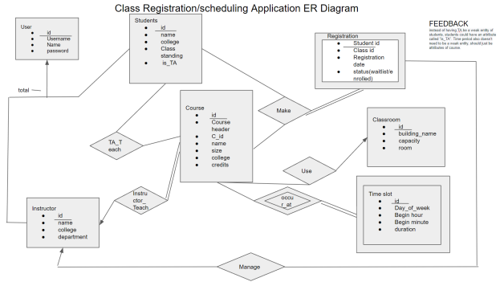
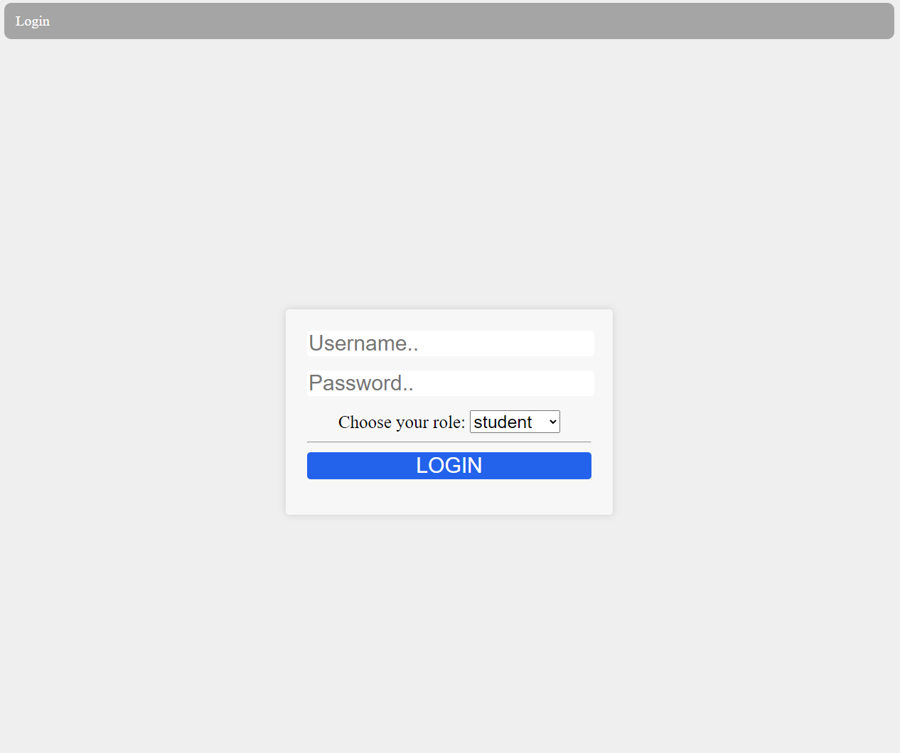
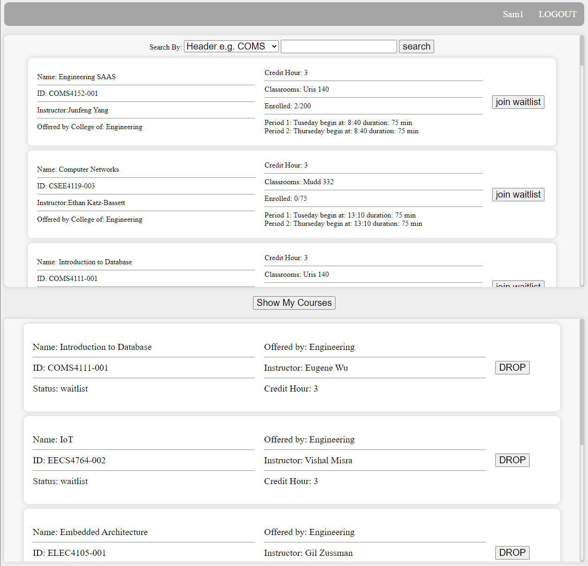
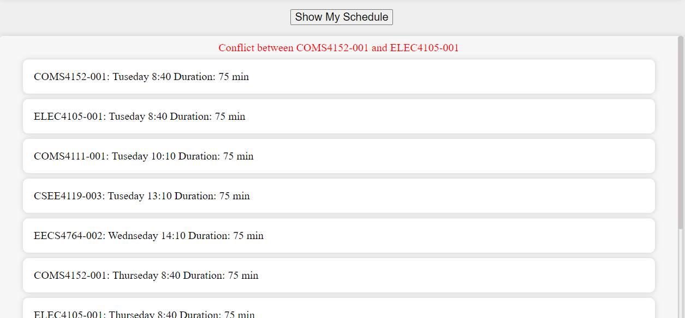
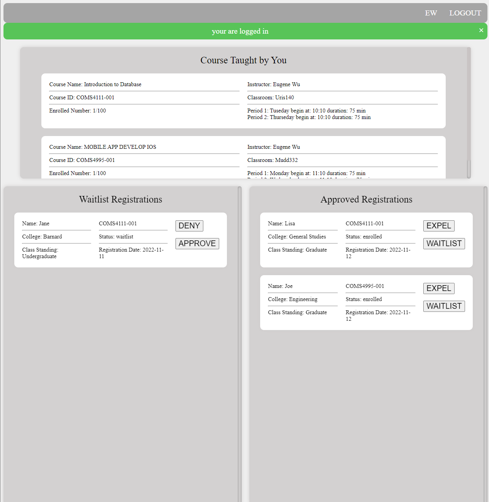

# CourseRegistration
 
 <li>This is a simple version of a University's Course Registration System.
  <li>Student can add/drop/search for courses, monitor their schedule and conflict of courses times
  <li>Instrcutors can manage students' registration of their classes.
 
 

